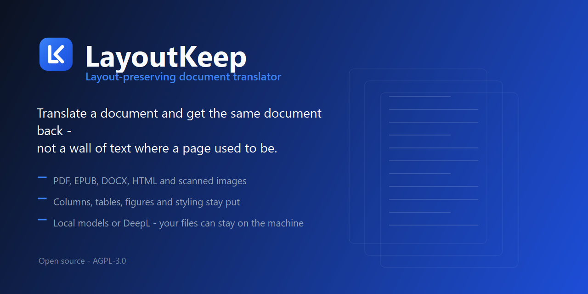
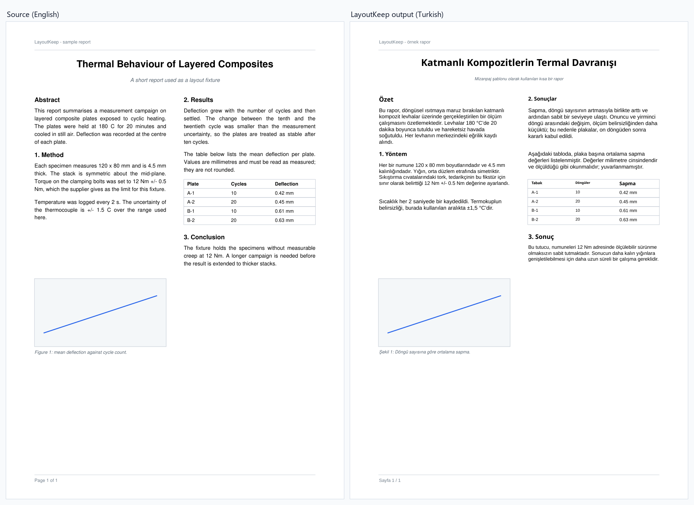

<p align="center">
  
</p>

<p align="center">
  <a href="README.md">English</a> · <a href="README.tr.md">Türkçe</a>
</p>

# LayoutKeep

Translate documents, e-books and images **while keeping their layout** — fonts, colours, styling,
text direction and structure stay as close to the original as the target language allows.

Runs locally. Bring your own model: a local LLM through LM Studio, Ollama or llama.cpp, or any
OpenAI-compatible cloud endpoint. Your documents never have to leave your machine.

> **Status: working, under active development.** A desktop application, a CLI, and readers and
> writers for PDF, EPUB, DOCX, HTML and images all run today. Rough edges remain — see
> [Known limits](#known-limits).

---

## Why this is hard, and what this project actually promises

Fully automatic layout-preserving translation does not exist — not here, not in any commercial
product. Three things fight you:

- **Text does not keep its length.** English→Turkish measures **0.93x on average** but ranges from
  **0.64x to 1.40x** across segments, so some lines shrink and others overflow the box they came
  from. The variance is the problem, not the average.
- **Fonts are subsetted.** A PDF usually embeds only the glyphs it used, so the Turkish `ğ ş İ ı`
  or the German `ß` are physically absent from the original font.
- **Reading order is not storage order.** A two-column page hands you interleaved sentences.

So LayoutKeep does not promise a perfect one-click result. It promises a **good first pass**, an
honest review signal (segments the pipeline is unsure about are flagged with a reason) and clean,
format-preserving output you can open immediately. The translation is written to disk and the
completion screen offers to open it — there is no separate manual-correction editor.

Every measured number in this README is reproducible; the commands are in
[`docs/MEASUREMENTS.md`](docs/MEASUREMENTS.md).

## What it looks like

The page below was translated English→Turkish through DeepL. Both images are the first page of
the same file, rendered at the same scale: two columns, the running header and footer, the
figure and its caption, the numbers in the table and the bold and italic runs are all where
they were. The source document and the translated output are in
[`docs/samples/`](docs/samples/), and both images are regenerated by
[`tools/make_comparison_image.py`](tools/make_comparison_image.py).



| Set up a job | While it runs | Provider endpoints |
|---|---|---|
|  |  |  |

The interface is English by default and ships Turkish and German; the choice is in the header
and is remembered. Every screen has a dark variant — the shots are in
[`docs/screenshots/`](docs/screenshots/).

## A longer example, and what it cost

The page above is one page. This is ten: a generated academic paper with two columns, numbered
sections, labelled line charts, tables with header rows, micrographs, a running head and page
numbers, translated English→Turkish through DeepL. Source and output are both in
[`docs/samples/`](docs/samples/) (`academic_paper_10.pdf` and `academic_paper_10.tr.pdf`), and the
generator is [`tools/make_academic_paper.py`](tools/make_academic_paper.py) so it can be rebuilt
from an empty checkout.

| | |
|---|---:|
| Pages | 10 |
| Blocks read | 741 |
| Segments translated | 30,603 characters in 91 requests |
| Flagged for review | 37 of 731 segments |
| Time | **65.2 s** — 12.7 s translating, 39.4 s fitting text to its boxes, 12.7 s writing the PDF |


**[Open the page-by-page comparison](docs/comparison.html)** — all ten pages, English and Turkish
overlaid with a divider you drag across. It is a single self-contained file (the renders travel
inside it), rebuilt from the current output by
[`tools/make_comparison_page.py`](tools/make_comparison_page.py), so it can never show a
comparison of something the pipeline no longer does. Viewing it from GitHub needs Pages enabled
for the repository, or a local clone and a browser.

Translation is under a fifth of the wall clock. **Fitting the translation back into boxes that
were set for English is the expensive part** — it is where a language that runs longer than the
source gets paid for, and where those 37 review flags come from. Writing the PDF is cheap here but
scales badly: a 100-page run costs 7 seconds a page against this one's 1.3.
[`docs/BENCHMARK.md`](docs/BENCHMARK.md) has the full numbers and what causes that.

## What works

| Input | Output | Fidelity |
|---|---|---|
| Digital PDF (text layer) | PDF, EPUB, DOCX, HTML, PNG/JPG | high — original PDF is edited in place, figures and vector art untouched |
| EPUB | EPUB, PDF, DOCX, HTML, PNG/JPG | high for EPUB→EPUB (layout lives in CSS); PDF re-flows, see limits |
| DOCX | all of the above | good |
| Images (PNG/JPG) | image, PDF, and the rest | moderate — OCR-dependent |

Latin scripts (Turkish, English, German, French, Spanish, …). The data model carries a `direction`
field so right-to-left support can be added without a rewrite, but it is not implemented.

**Also handled, because real documents do this:** rotated text at any angle, mirrored text
(detected and flagged rather than silently un-mirrored), bold/italic runs carried through
translation as inline markers, and metric-compatible font substitution when the original font
cannot render the target language.

## Values that must not be translated

Torque figures, tolerances, part numbers, form identifiers and diagram callouts are replaced with
tokens before the model sees them and restored from the source afterwards — a model cannot
paraphrase what was never in its prompt. Measured on IRS Form W-4: 162 values held back, 35 of 116
segments answered without a request at all, and every checked value appears in the output exactly
as often as in the source.

## Install (development)

Requires **Python 3.13** (3.11–3.13 supported; 3.14 breaks the OCR dependencies).

```bash
git clone <repo-url> && cd LayoutKeep
python -m venv .venv
.venv/Scripts/python -m pip install -e ".[pdf,epub,docx,ui,dev]"
```

The core package (`layoutkeep`) has **no mandatory third-party dependencies** by design — the
reader/writer tiers are optional extras, so a CI job that only needs the DocIR core and a fake
provider stays stdlib-only. Install the extras that match the formats you actually touch:

| Extra | What it pulls in | Needed for |
|---|---|---|
| `pdf` | `pymupdf` | PDF read/write, EPUB→PDF reflow, image rendering |
| `epub` | `ebooklib`, `lxml` | EPUB read/write |
| `docx` | `lxml` | DOCX read/write (zipfile + lxml, no python-docx) |
| `fitting` | `fonttools` | Glyph coverage + real font metrics for the fit engine (no PyMuPDF) |
| `ocr` | RapidOCR / ONNX runtime | Scanned-document and image translation (Faz 2) |
| `ui` | `PySide6` | The desktop application |
| `dev` | `pytest`, `ruff` | Tests and linting |

Everything at once: `.[pdf,epub,docx,ocr,ui,dev]`.

## Usage

### Desktop application

```bash
.venv/Scripts/python -m layoutkeep.ui.app
```

Three steps: choose the document and format, watch the translation, then open the finished output
(or start another job). A packaged build is produced with `packaging/layoutkeep_onefile.spec` —
see [`docs/PACKAGING.md`](docs/PACKAGING.md).

### Command line

See how the reader understood a document before translating anything:

```bash
layoutkeep inspect book.epub --sample 5
```

Translate through a local LM Studio or Ollama server:

```bash
layoutkeep translate book.epub --to tr --base-url http://localhost:1234/v1 --model your-model
```

Or through DeepL, which is a translation service rather than a model to prompt. There is no model
to choose - the key decides the host, and a free key ends in `:fx`. Unlike the local path, this
sends the text to DeepL's servers:

```bash
layoutkeep translate book.epub --to tr --provider deepl --api-key YOUR-KEY:fx
```

In the desktop application both live in the provider list on the setup screen; the settings dialog
creates and edits them as named profiles.

`--limit 20` translates only the first 20 segments, which is the cheap way to check quality before
committing to a whole book. `--save-project out.lkproj` writes a re-usable project file
(segments, layout, flags) that future runs and tooling can read back.

## Review flags

Anything the pipeline is not sure about is flagged with a reason on the segment, so the signal is
legible (in a report, a saved project, or tooling) rather than a bare boolean:

```
model metni çevirmeden aynen geri verdi        (the model handed the source back untranslated)
3 korunan değer çeviride yok                   (protected values missing from the translation)
kalın/italik biçimlendirme kayboldu            (inline styling lost)
çeviri kutuya sığmadı, küçültme yetmedi        (translation does not fit, shrinking was not enough)
metin aynalanmış, olduğu gibi geri yazılacak   (mirrored text, written back as-is)
OCR güveni düşük                               (low OCR confidence)
```

## Known limits

- **EPUB→PDF re-flows the book.** The conversion re-lays the EPUB with MuPDF's Story engine
  (which honours `page-break-before`, unlike its `layout()`), so chapter headings start fresh
  pages and the reader-resolved CSS font sizes and alignment carry over. Reflow is still not
  pixel-identical to a hand-set PDF, but type sizes, alignment and figures are now preserved.
- **The EPUB reader captures about 99% of a book's visible text** (measured; the rest is text
  only reachable through markup edge cases); images are now extracted as `ImageRef`s (base64) so
  rebuilt documents keep their figures.
- **Terminology drifts across segments.** Measured 6–12 consistent renderings out of 83 repeated
  terms. Sending neighbouring context as a hint helps one model and harms another, so it is not
  currently switched off or on by default — see `docs/MEASUREMENTS.md` §6.
- Mirrored text is detected but cannot be written back mirrored.
- **Writing a large PDF is slow, and gets slower per page.** `insert_htmlbox` embeds its own copy
  of a font on every call, so a document with thousands of blocks builds thousands of duplicate
  subsets; `garbage=4` collapses them at save, but the work is already spent. 10 pages write in
  1.3 s each, 100 pages in 7.0 s each. Measured in [`docs/BENCHMARK.md`](docs/BENCHMARK.md).

## Tuning it

The numbers the layout stages depend on - how much two boxes must overlap to be cells of one
table row, how far apart two lines can sit and still be one paragraph, how small text may be
shrunk before it stops being readable - are editable at runtime under **Advanced Settings → Developer**.
Each carries what it does and what goes wrong if it is set badly, defaults are the values the
code shipped with, and there is a reset. They are read where they are used, so a change applies
without restarting. The CLI reads the same file, so the two cannot drift apart on one machine.

## Architecture

Every reader produces one intermediate representation (**DocIR**) and every writer consumes it.
Readers and writers never know about each other, and the translation layer never sees a bounding
box. Adding a format means adding one reader and one writer; the core does not change.

```
readers/ ──▶ DocIR ──▶ providers/ ──▶ fitting/ ──▶ writers/
                       (translate)    (make it fit)
```

[`docs/CONTRACT.md`](docs/CONTRACT.md) holds the binding architectural rules.
[`docs/NEREDE-NE-VAR.md`](docs/NEREDE-NE-VAR.md) is the map of which file does what.

## A note on the tests

The suite is large and green. **Treat that as weak evidence.** Every serious defect found in this
project so far surfaced from running the product on a real document, never from a passing test —
silently dropped figures, pages discarded by a page range, review flags thrown away before they
reached the saved project, an entire feature dead in the packaged build. Tests here pin down what was
already learned the hard way; they do not discover it. Run the thing.

## Licence

**AGPL-3.0-or-later.** See [LICENSE](LICENSE).

Bundled fonts (Tinos, Arimo, Cousine, Caladea, Carlito, Noto) are under the SIL Open Font License
1.1; their licence texts travel with them in `src/layoutkeep/assets/fonts/licenses/`.

## Legal note

LayoutKeep does not remove DRM and will refuse protected files. Translating a copyrighted work
produces a derivative work — that is generally fine for personal use and not fine to distribute.
What you translate, and what you do with the result, is your responsibility.
