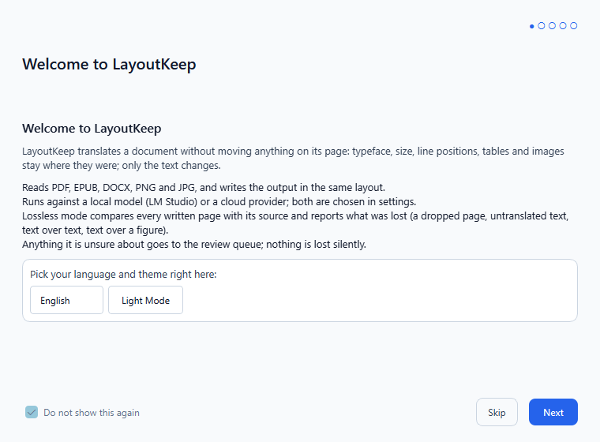
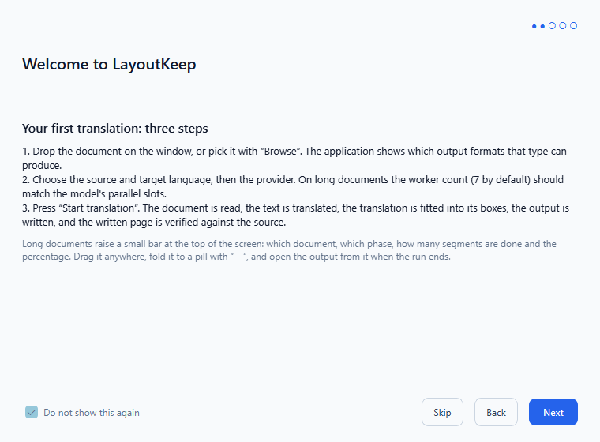
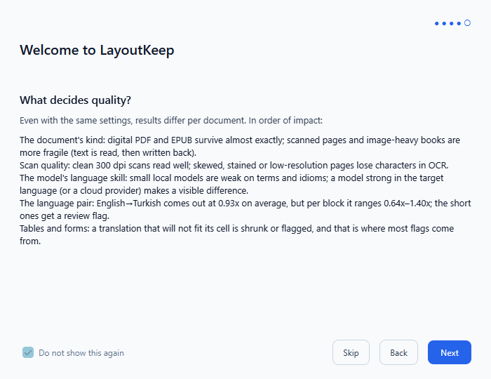
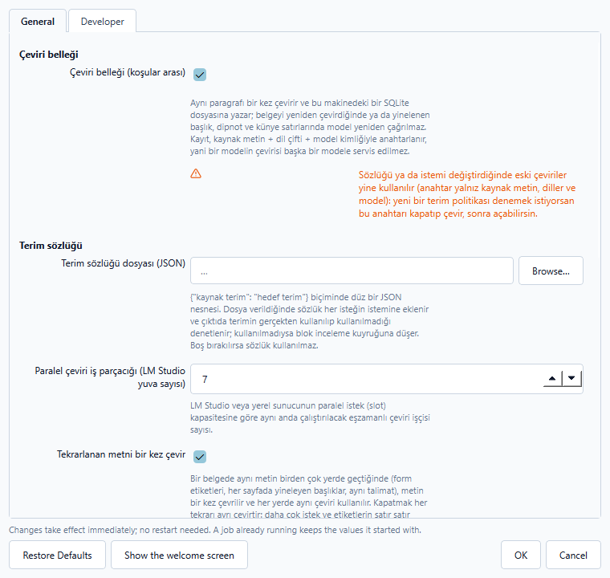
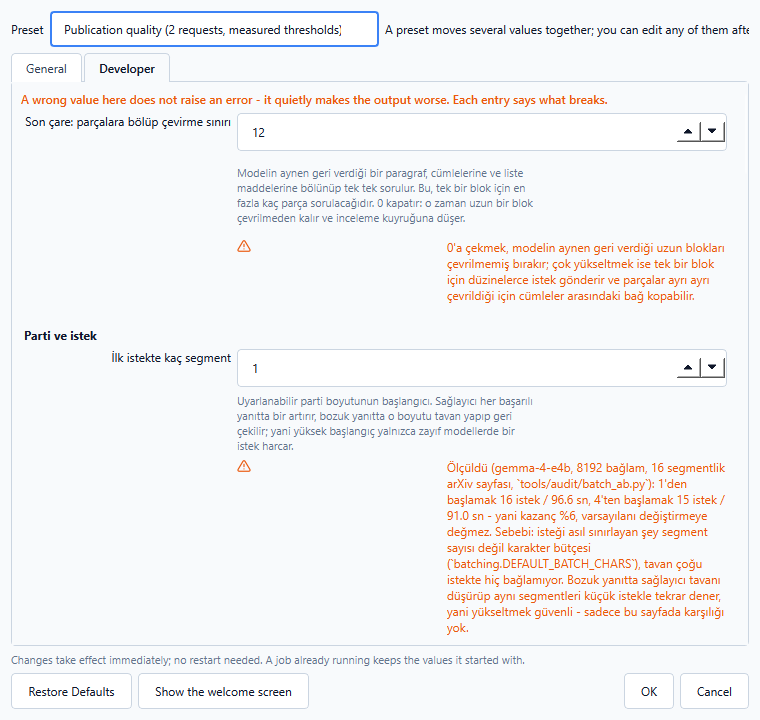
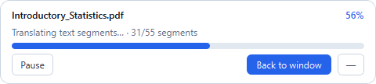
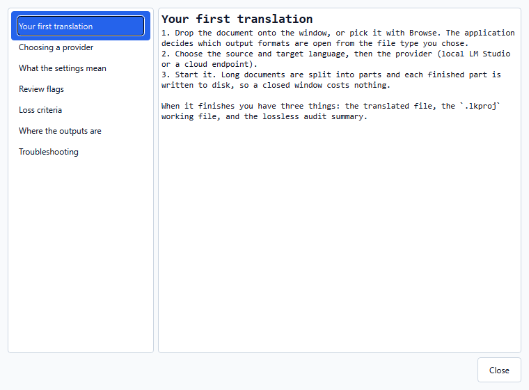
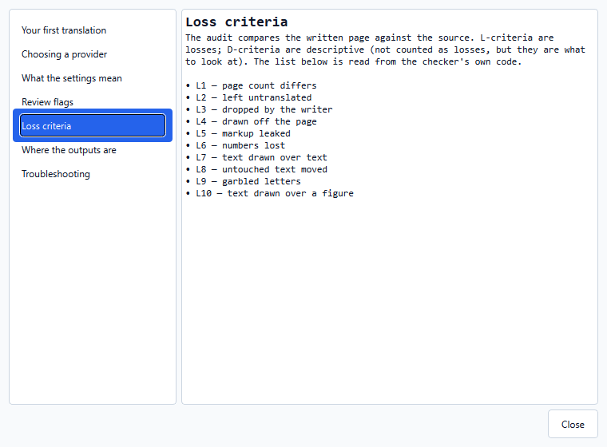
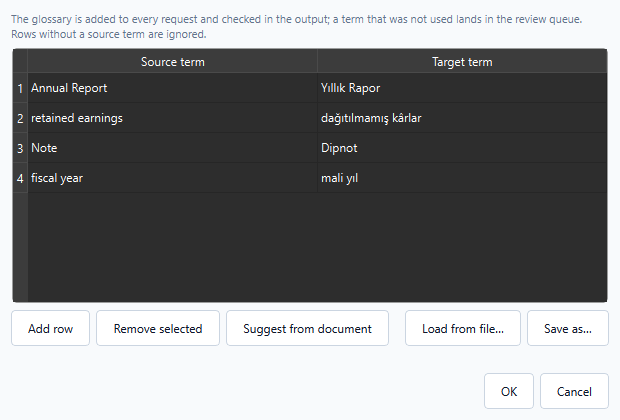

<p align="center">
  
</p>

<p align="center">
  <a href="README.md">English</a> · <a href="README.tr.md">Türkçe</a>
</p>

<p align="center">
  <a href="https://salihefetosunbayraktar.github.io/LayoutKeep/docs/comparison.html"><strong>See a translated document side by side →</strong></a><br>
  <sub>Ten pages of an academic paper, English and Turkish, under a divider you drag.</sub>
</p>

# LayoutKeep

Translate documents, e-books and images **while keeping their layout** — fonts, colours, styling,
text direction and structure stay as close to the original as the target language allows.

Runs locally. Bring your own model: a local LLM through LM Studio, Ollama or llama.cpp, or any
OpenAI-compatible cloud endpoint. Your documents never have to leave your machine.

> **Status: 14 of 20 format pairs are open.** PDF, EPUB and DOCX all convert to each other and to
> HTML; EPUB and DOCX also convert to PNG, and DOCX converts to PDF. Every open pair was checked
> word-for-word against a realistic fixture with nothing missing, not just a ratio close to 100%.
> The rest stay locked — shown in the interface with a lock and the reason, rather than removed
> or offered — until the same check passes for them.
> [`docs/ENGINE-ARCHITECTURE.md`](docs/ENGINE-ARCHITECTURE.md) has the measurement and what has
> to be true before each one opens.

---

> **Where the code on this branch stands.** `main` carries the last reviewed release; the
> campaign that produced the screenshots, the comparison site and the roadmap below lives on
> `feature/lossless-campaign-continuation` and has not been merged here on purpose. The documents
> and images are published; the code they were produced with is reviewed before it is released.

## Why this is hard, and what this project actually promises

Fully automatic layout-preserving translation does not exist — not here, not in any commercial
product. Three things fight you:

- **Text does not keep its length.** English→Turkish measures **0.93x on average** but ranges from
  **0.64x to 1.40x** across segments, so some lines shrink and others overflow the box they came
  from. The variance is the problem, not the average.
- **Fonts are subsetted.** A PDF usually embeds only the glyphs it used, so the Turkish `ğ ş İ ı`
  or the German `ß` are physically absent from the original font.
- **Reading order is not storage order.** A two-column page hands you interleaved sentences.

So LayoutKeep does not promise a perfect one-click result. It promises a **good first pass**, an
honest review signal (segments the pipeline is unsure about are flagged with a reason) and clean,
format-preserving output you can open immediately. The translation is written to disk and the
completion screen offers to open it — there is no separate manual-correction editor.

Every measured number in this README is reproducible; the commands are in
[`docs/MEASUREMENTS.md`](docs/MEASUREMENTS.md).

## What it looks like

The page below was translated English→Turkish through DeepL. Both images are the first page of
the same file, rendered at the same scale: two columns, the running header and footer, the
figure and its caption, the numbers in the table and the bold and italic runs are all where
they were. The source document and the translated output are in
[`docs/samples/`](docs/samples/), and both images are regenerated by
[`tools/make_comparison_image.py`](tools/make_comparison_image.py).


| Set up a job | While it runs | Provider endpoints |
|---|---|---|
|  |  |  |

| First run explains itself | Step by step | What decides quality |
|---|---|---|
|  |  |  |

| Glossary and translation memory | Where the numbers live | Follow a long run without the window |
|---|---|---|
|  |  |  |

| Help, in the application | What the flags and criteria mean | Editing the glossary |
|---|---|---|
|  |  |  |

The interface is English by default and ships Turkish and German; the choice is in the header
and is remembered — and the welcome screen, which explains the pipeline, the provider choice and
what decides quality, offers both before anything else and can be skipped. Every screen has a dark
variant — the shots are in [`docs/screenshots/`](docs/screenshots/).

## A longer example, and what it cost

The page above is one page. This is ten: a generated academic paper with two columns, numbered
sections, labelled line charts, tables with header rows, micrographs, a running head and page
numbers, translated English→Turkish through DeepL. Source and output are both in
[`docs/samples/`](docs/samples/) (`academic_paper_10.pdf` and `academic_paper_10.tr.pdf`), and the
generator is [`tools/make_academic_paper.py`](tools/make_academic_paper.py) so it can be rebuilt
from an empty checkout.

| | |
|---|---:|
| Pages | 10 |
| Blocks read | 741 |
| Segments translated | 30,603 characters in 91 requests |
| Flagged for review | 37 of 731 segments |
| Time | **65.2 s** — 12.7 s translating, 39.4 s fitting text to its boxes, 12.7 s writing the PDF |


**[Open the page-by-page comparison](https://salihefetosunbayraktar.github.io/LayoutKeep/docs/comparison.html)** — all ten pages, English and Turkish
overlaid with a divider you drag across. It is a single self-contained file (the renders travel
inside it), rebuilt from the current output by
[`tools/make_comparison_page.py`](tools/make_comparison_page.py), so it can never show a
comparison of something the pipeline no longer does. The file itself is
[`docs/comparison.html`](docs/comparison.html) if you would rather open it from a clone.

**[And the wider comparison](https://salihefetosunbayraktar.github.io/LayoutKeep/docs/comparison/index.html)** — the same draggable divider over
**every held-out sample**: arXiv papers, two IRS instruction books, a NASA scan, a PLOS article,
two Wikipedia articles, a Gutenberg novel, two Internet Archive scans, a WPA poster and the
newest live runs. Each document carries what the audit measured on it, so a page that lost
something says so beside the page itself. Generated from source and output by
[`tools/audit/comparison_site.py`](tools/audit/comparison_site.py) — pages are chosen evenly
across a document, never retouched.

Translation is under a fifth of the wall clock. **Fitting the translation back into boxes that
were set for English is the expensive part** — it is where a language that runs longer than the
source gets paid for, and where those 37 review flags come from. Writing the PDF is cheap here but
scales badly: a 100-page run costs 7 seconds a page against this one's 1.3.
[`docs/BENCHMARK.md`](docs/BENCHMARK.md) has the full numbers and what causes that.

## What works

| Input → Output | State | Measured |
|---|---|---|
| **PDF → PDF / DOCX / EPUB / HTML** | **open** | zero words missing against the rich fixture on every one |
| **EPUB → EPUB / DOCX / HTML / PNG** | **open** | same check, same result |
| **DOCX → DOCX / EPUB / HTML / PNG / PDF** | **open** | same check; the PDF generator's image-drawing gap was fixed to get here |
| **PNG → DOCX** | **open** | OCR recall verified on a realistic scanned page, not just the tiny fixture that first found the regression |
| anything else → PNG/JPG | locked | not yet checked against a rich fixture |
| everything else | locked | measures well now (100% or explained); opens one pair at a time as a product decision, not a fidelity one |

Every row is [`tools/audit/format_matrix.py`](tools/audit/format_matrix.py) (small synthetic
fixtures) and [`tools/audit/faz2_candidates.py`](tools/audit/faz2_candidates.py) (the rich
fixtures a pair actually has to pass before it opens), both of which you can run yourself. The
lock is one module — [`core/capabilities.py`](src/layoutkeep/core/capabilities.py) — read by
both the application and the command line, so they cannot disagree about what is ready.

Latin scripts (Turkish, English, German, French, Spanish, …). The data model carries a `direction`
field so right-to-left support can be added without a rewrite, but it is not implemented.

## Terms, memory, and the review queue

Three things decide whether a long document reads as one document rather than as a pile of pages,
and all three are in the application (and on the command line):

- **A glossary** — a `{"source term": "target term"}` JSON file, or a two-column
  CSV/TSV table (the spreadsheet a term list usually starts as). It is added to every
  request *and* checked afterwards: a term the model did not use puts its block in the review
  queue with the reason. Advanced Settings has a table editor for it (`--glossary` on the CLI).
- **A translation memory** — a SQLite file keyed by (source text, language pair, model identity).
  Running the same document again costs almost nothing, repeated running headers and footnotes are
  translated once, and the key carries a fingerprint of the glossary, so changing the term policy
  cannot be answered from entries written before it. The completion screen reports how much came
  from memory. `--memory` on the CLI; on by default in the application.
- **The review queue** — every flag carries why it was raised (a block that did not fit, a term
  that was not used, a sentence the model returned unchanged), so the list is a work list and not a
  score. `## Review flags` below lists the reasons.

The application also explains itself in place: a five-page welcome screen on the first run (with the
interface language and the theme selectable there), a `?` button in the header opening a help
screen whose criteria list is read from the checker's own code, and a caption under every advanced
setting that says what goes wrong if it is wrong.

## What decides how good a translation comes out

The same settings produce very different results on different documents. In order of how much they
move the outcome, with the numbers this project has actually measured:

| Factor | What it does |
|---|---|
| **The document's kind** | An EPUB keeps its layout in CSS and comes out at 95%+ fidelity; a digital PDF is next, because its text is exactly where the source put it; a scanned page is the fragile one — text is recognised, the old letters are painted out, and the translation is written back, so OCR sits in the loop |
| **Scan resolution and cleanliness** | Clean 300 dpi scans read reliably. Skewed, stained or low-resolution pages lose characters in OCR, and a lost character is a lost word: cropping a page to its content area once ate a whole paragraph on a dense page (threshold-guarded now, and the case is a regression test) |
| **The model's skill in the target language** | The biggest lever on the *text*. The bundled flow reproduces numbers, names and lists faithfully and stumbles on idioms and terms — `việt語` for "Vietnamese" was an artefact of asking for a language *code* instead of a language *name*, which is why the prompt now names the language and its script |
| **The language pair's length behaviour** | English→Turkish measures **0.93x** on average and **0.64x–1.40x per block**. A block that comes out far shorter than its box is flagged rather than padded with invented words; one that comes out longer is asked for again in shorter form, then shrunk, then flagged |
| **Tables and forms** | The most flagged areas, for a structural reason: a cell has room for the source's words, not for a translation that runs longer. `--fit-mode reflow` (still being measured) lets a block push the ones under it down instead of shrinking |
| **The model server's configuration** | A local model's context window is shared across its parallel slots: `-c 8192` with 7 workers leaves ~1.2k tokens per request, and a long paragraph overflows it (the failure read as "model not found" until the error body was opened). 32768 for 7 workers is what this project runs |

Nothing here is hidden from a run: each factor shows up in the fitting line
(`as_is=50 shrunk=9 expanded=2 overflow=3`), in the audit (L1–L10 loss conditions, D1–D3
descriptive ones) or in the review queue inside the application.

**Also handled, because real documents do this:** rotated text at any angle, mirrored text
(detected and flagged rather than silently un-mirrored), bold/italic runs carried through
translation as inline markers, and metric-compatible font substitution when the original font
cannot render the target language.

## Values that must not be translated

Torque figures, tolerances, part numbers, form identifiers and diagram callouts are replaced with
tokens before the model sees them and restored from the source afterwards — a model cannot
paraphrase what was never in its prompt. Measured on IRS Form W-4: 162 values held back, 35 of 116
segments answered without a request at all, and every checked value appears in the output exactly
as often as in the source.

## Install (development)

Requires **Python 3.13** (3.11–3.13 supported; 3.14 breaks the OCR dependencies).

```bash
git clone <repo-url> && cd LayoutKeep
python -m venv .venv
.venv/Scripts/python -m pip install -e ".[pdf,epub,docx,ui,dev]"
```

The core package (`layoutkeep`) has **no mandatory third-party dependencies** by design — the
reader/writer tiers are optional extras, so a CI job that only needs the DocIR core and a fake
provider stays stdlib-only. Install the extras that match the formats you actually touch:

| Extra | What it pulls in | Needed for |
|---|---|---|
| `pdf` | `pymupdf` | PDF read/write, EPUB→PDF reflow, image rendering |
| `epub` | `ebooklib`, `lxml` | EPUB read/write |
| `docx` | `lxml` | DOCX read/write (zipfile + lxml, no python-docx) |
| `fitting` | `fonttools` | Glyph coverage + real font metrics for the fit engine (no PyMuPDF) |
| `ocr` | RapidOCR / ONNX runtime | Scanned-document and image translation (Faz 2) |
| `ui` | `PySide6` | The desktop application |
| `dev` | `pytest`, `ruff` | Tests and linting |

Everything at once: `.[pdf,epub,docx,ocr,ui,dev]`.

## Usage

### Desktop application

```bash
.venv/Scripts/python -m layoutkeep.ui.app
```

Three steps: choose the document and format, watch the translation, then open the finished output
(or start another job). A packaged build is produced with `packaging/layoutkeep_onefile.spec` —
see [`docs/PACKAGING.md`](docs/PACKAGING.md).

Long documents get a **floating progress bar**: a small, frameless window that stays on top of
everything else, showing which document is being translated, which phase it is in, how many
segments are done and the percentage. Drag it anywhere, fold it down to a pill with the `—` button,
or use *Back to window* to return to the full window. When the run ends it turns green and offers
the output and a fresh start. Turn it off with the `ui.floating_progress` entry in the advanced
settings.

### Command line

See how the reader understood a document before translating anything:

```bash
layoutkeep inspect book.epub --sample 5
```

Translate through a local LM Studio or Ollama server:

```bash
layoutkeep translate book.epub --to tr --base-url http://localhost:1234/v1 --model your-model
```

Or through DeepL, which is a translation service rather than a model to prompt. There is no model
to choose - the key decides the host, and a free key ends in `:fx`. Unlike the local path, this
sends the text to DeepL's servers:

```bash
layoutkeep translate book.epub --to tr --provider deepl --api-key YOUR-KEY:fx
```

In the desktop application both live in the provider list on the setup screen; the settings dialog
creates and edits them as named profiles.

`--limit 20` translates only the first 20 segments, which is the cheap way to check quality before
committing to a whole book. `--save-project out.lkproj` writes a re-usable project file
(segments, layout, flags) that future runs and tooling can read back.

## Review flags

Anything the pipeline is not sure about is flagged with a reason on the segment, so the signal is
legible (in a report, a saved project, or tooling) rather than a bare boolean:

```
model metni çevirmeden aynen geri verdi        (the model handed the source back untranslated)
3 korunan değer çeviride yok                   (protected values missing from the translation)
kalın/italik biçimlendirme kayboldu            (inline styling lost)
çeviri kutuya sığmadı, küçültme yetmedi        (translation does not fit, shrinking was not enough)
metin aynalanmış, olduğu gibi geri yazılacak   (mirrored text, written back as-is)
OCR güveni düşük                               (low OCR confidence)
```

## Known limits

- **EPUB→PDF re-flows the book.** The conversion re-lays the EPUB with MuPDF's Story engine
  (which honours `page-break-before`, unlike its `layout()`), so chapter headings start fresh
  pages and the reader-resolved CSS font sizes and alignment carry over. Reflow is still not
  pixel-identical to a hand-set PDF, but type sizes, alignment and figures are now preserved.
- **The EPUB reader captures about 99% of a book's visible text** (measured; the rest is text
  only reachable through markup edge cases); images are now extracted as `ImageRef`s (base64) so
  rebuilt documents keep their figures.
- **Terminology drifts across segments.** Measured 6–12 consistent renderings out of 83 repeated
  terms. Sending neighbouring context as a hint helps one model and harms another, so it is not
  currently switched off or on by default — see `docs/MEASUREMENTS.md` §6.
- Mirrored text is detected but cannot be written back mirrored.
- **Writing a large PDF is slow, and gets slower per page.** `insert_htmlbox` embeds its own copy
  of a font on every call, so a document with thousands of blocks builds thousands of duplicate
  subsets; `garbage=4` collapses them at save, but the work is already spent. 10 pages write in
  1.3 s each, 100 pages in 7.0 s each. Measured in [`docs/BENCHMARK.md`](docs/BENCHMARK.md).

## Tuning it

The numbers the layout stages depend on - how much two boxes must overlap to be cells of one
table row, how far apart two lines can sit and still be one paragraph, how small text may be
shrunk before it stops being readable - are editable at runtime under **Advanced Settings → Developer**.
Each carries what it does and what goes wrong if it is set badly, defaults are the values the
code shipped with, and there is a reset. They are read where they are used, so a change applies
without restarting. The CLI reads the same file, so the two cannot drift apart on one machine.

## Architecture

Every reader produces one intermediate representation (**DocIR**) and every writer consumes it.
Readers and writers never know about each other, and the translation layer never sees a bounding
box. Adding a format means adding one reader and one writer; the core does not change.

```
readers/ ──▶ DocIR ──▶ providers/ ──▶ fitting/ ──▶ writers/
                       (translate)    (make it fit)
```

[`docs/CONTRACT.md`](docs/CONTRACT.md) holds the binding architectural rules.
[`docs/MAP.md`](docs/MAP.md) is the map of which file does what.

## A note on the tests

The suite is large and green. **Treat that as weak evidence.** Every serious defect found in this
project so far surfaced from running the product on a real document, never from a passing test —
silently dropped figures, pages discarded by a page range, review flags thrown away before they
reached the saved project, an entire feature dead in the packaged build. Tests here pin down what was
already learned the hard way; they do not discover it. Run the thing.

## Licence

**AGPL-3.0-or-later.** See [LICENSE](LICENSE).

Bundled fonts (Tinos, Arimo, Cousine, Caladea, Carlito, Noto) are under the SIL Open Font License
1.1; their licence texts travel with them in `src/layoutkeep/assets/fonts/licenses/`.

Everything this project is built on — every library, every font, and where the sample documents
come from — is listed with its licence in [CREDITS.md](CREDITS.md).

## Legal note

LayoutKeep does not remove DRM and will refuse protected files. Translating a copyrighted work
produces a derivative work — that is generally fine for personal use and not fine to distribute.
What you translate, and what you do with the result, is your responsibility.
