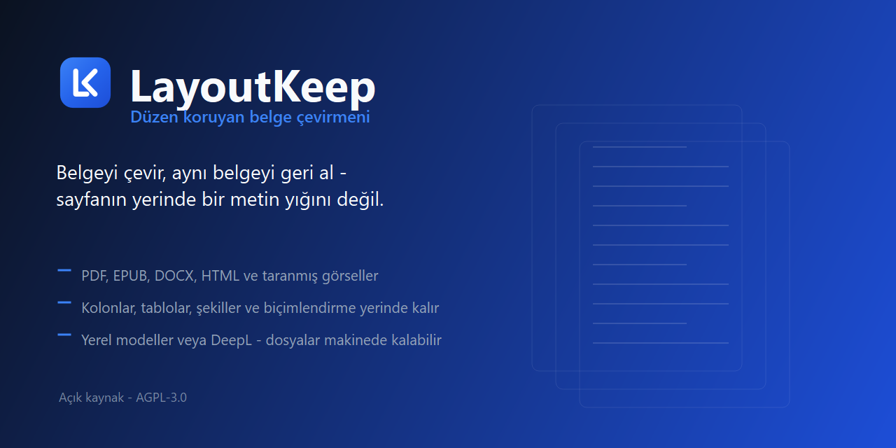
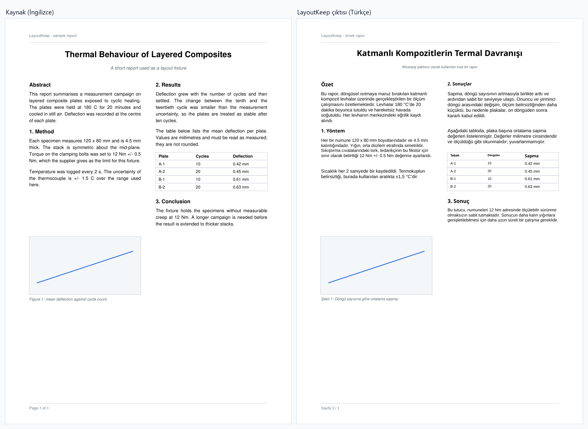
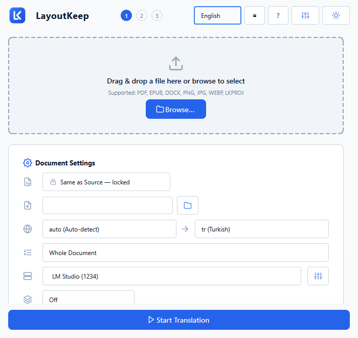
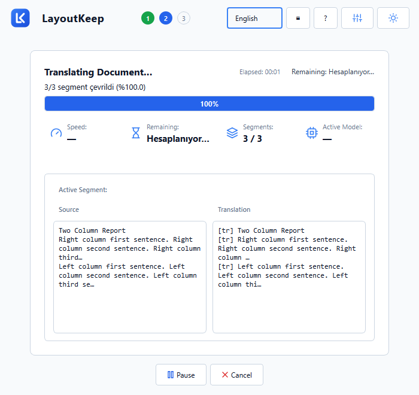
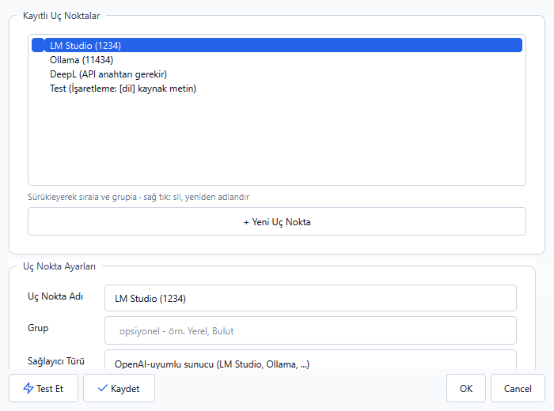
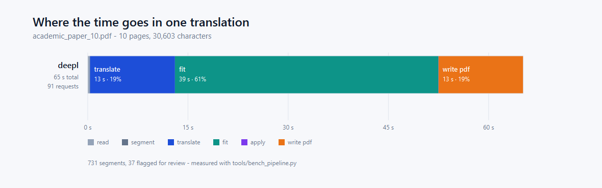

<p align="center">
  
</p>

<p align="center">
  <a href="README.md">English</a> · <a href="README.tr.md">Türkçe</a>
</p>

<p align="center">
  <a href="https://salihefetosunbayraktar.github.io/LayoutKeep/docs/comparison.html"><strong>Çevrilmiş bir belgeyi yan yana görün →</strong></a><br>
  <sub>Akademik bir makalenin on sayfası, İngilizce ve Türkçe, sürüklenebilir bir ayırıcı altında.</sub>
</p>

# LayoutKeep

Belgeleri, e-kitapları ve görselleri **düzenini koruyarak** çevirir — yazı tipleri, renkler,
biçimlendirme, metin yönü ve yapı, hedef dilin izin verdiği ölçüde özgün haline yakın kalır.

Yerel çalışır. Modelini kendin getirirsin: LM Studio, Ollama veya llama.cpp üzerinden yerel bir
LLM, ya da OpenAI-uyumlu herhangi bir bulut uç noktası. Belgelerinin makineden çıkması gerekmez.

> **Durum: PDF'ten PDF'e açık. Diğer her şey kilitli.** EPUB, DOCX, HTML ve görseller için
> okuyucu ve yazıcılar var, ve bu dönüşümlerin hepsi ölçüldü: hiçbiri hata vermiyor, birkaçı ise
> belgenin görsellerini, kalın/italik biçimlendirmesini veya kelimelerinin üçte birini sessizce
> kaybediyor. Arayüzde kaldırılmadan ya da sunulmadan, kilitle ve gerekçesiyle gösteriliyorlar.
> Ölçüm ve her birinin açılması için ne gerektiği:
> [`docs/ENGINE-ARCHITECTURE.md`](docs/ENGINE-ARCHITECTURE.md).

---

## Bu iş neden zor, ve bu proje tam olarak ne vadediyor

Tam otomatik, düzeni koruyan çeviri diye bir şey yok — ne burada ne de herhangi bir ticari üründe.
Üç şey size karşı çalışır:

- **Metin uzunluğunu korumaz.** İngilizce→Türkçe **ortalama 0,93x** ölçülüyor ama segmentler
  arasında **0,64x ile 1,40x** arasında geziniyor; yani bazı satırlar kısalır, bazıları geldiği
  kutuyu taşırır. Sorun ortalama değil, sapma.
- **Yazı tipleri altkümelenir.** Bir PDF genellikle yalnızca kullandığı glifleri gömer; Türkçenin
  `ğ ş İ ı` harfleri ya da Almancanın `ß`'si özgün yazı tipinde fiziksel olarak yoktur.
- **Okuma sırası, saklama sırası değildir.** İki kolonlu bir sayfa size cümleleri iç içe geçmiş
  halde verir.

Bu yüzden LayoutKeep kusursuz, tek tıkla bir sonuç vadetmiyor. **İyi bir ilk geçiş**, dürüst bir
gözden geçirme sinyali (motorun emin olmadığı segmentler gerekçesiyle işaretlenir) ve hemen
açabileceğiniz, formatı korunmuş bir çıktı vadediyor. Çeviri diske yazılır ve tamamlanma ekranı
onu açmayı önerir; ayrı bir elle düzeltme editörü yoktur.

Bu dosyadaki her ölçülmüş sayı yeniden üretilebilir; komutlar
[`docs/MEASUREMENTS.md`](docs/MEASUREMENTS.md) içinde.

## Nasıl görünüyor

Aşağıdaki sayfa DeepL üzerinden İngilizce→Türkçe çevrildi. İki görüntü de aynı dosyanın ilk
sayfası, aynı ölçekte: iki kolon, sayfa üstü ve altı, şekil ve altyazısı, tablodaki sayılar,
kalın ve italik parçalar — hepsi bulundukları yerde. Kaynak belge ve çevrilmiş çıktı
[`docs/samples/`](docs/samples/) altında; iki görüntü de
[`tools/make_comparison_image.py`](tools/make_comparison_image.py) ile yeniden üretilir.



| İş kurulumu | Çalışırken | Sağlayıcı uç noktaları |
|---|---|---|
|  |  |  |

Arayüz varsayılan olarak İngilizcedir; Türkçe ve Almanca da gelir, seçim başlıktadır ve
hatırlanır. Her ekranın koyu bir varyantı var — görüntüler
[`docs/screenshots/`](docs/screenshots/) altında.

## Daha uzun bir örnek, ve maliyeti

Yukarıdaki tek bir sayfa. Bu on sayfa: iki sütunlu, numaralı bölümleri, etiketli çizgi
grafikleri, başlık satırlı tabloları, mikroskop görüntüleri, üst bilgisi ve sayfa numaraları olan
üretilmiş bir akademik makale, DeepL ile İngilizceden Türkçeye çevrildi. Kaynak ve çıktı
[`docs/samples/`](docs/samples/) içinde (`academic_paper_10.pdf` ve `academic_paper_10.tr.pdf`),
üreteci [`tools/make_academic_paper.py`](tools/make_academic_paper.py) — boş bir kopyadan
yeniden kurulabilir.

| | |
|---|---:|
| Sayfa | 10 |
| Okunan blok | 741 |
| Çevrilen | 91 istekte 30.603 karakter |
| İncelemeye işaretlenen | 731 segmentin 37'si |
| Süre | **65,2 sn** — 12,7 sn çeviri, 39,4 sn sığdırma, 12,7 sn PDF yazma |



**[Sayfa sayfa karşılaştırmayı açın](https://salihefetosunbayraktar.github.io/LayoutKeep/docs/comparison.html)** — on sayfanın tamamı, İngilizce ve Türkçe,
sürüklediğiniz bir ayırıcının altında. Kendi kendine yeten tek bir dosya (görseller içinde
taşınıyor) ve güncel çıktıdan
[`tools/make_comparison_page.py`](tools/make_comparison_page.py) ile yeniden üretiliyor; yani
boru hattının artık yapmadığı bir şeyi gösteremez.

Çeviri, geçen sürenin beşte birinden az. **Asıl pahalı kısım, çevirinin İngilizce için
ayarlanmış kutulara geri sığdırılması** — kaynaktan uzun bir dilin bedeli orada ödeniyor ve o 37
inceleme bayrağı oradan geliyor. PDF yazmak burada ucuz ama ölçekle kötüleşiyor: 100 sayfalık bir
koşu sayfa başına 7 saniye, buradaki 1,3 saniyeye karşılık.
[`docs/BENCHMARK.md`](docs/BENCHMARK.md) tüm rakamları ve nedenini içerir.

## Ne çalışıyor

| Girdi → Çıktı | Durum | Ölçüm |
|---|---|---|
| **PDF → PDF** | **açık** | tüm metin, tüm biçimlendirme, şekiller ve vektör çizimler dokunulmadan — özgün dosya yerinde düzenlenir |
| EPUB → DOCX | kilitli | DocIR'in taşıdığı görseli düşürüyor: 1'de 0 |
| EPUB/DOCX → PNG | kilitli | kelimelerin üçte biri geri okunamıyor: %63 ve %73 |
| herhangi bir şey → PNG/JPG | kilitli | görselin metin katmanı olmaz; sonuç aranamaz |
| → HTML | kilitli | sayfalı belge tek akışa çöküyor: 4 sayfadan 1 |
| PDF → EPUB, EPUB → PDF, EPUB → EPUB, DOCX → DOCX | kilitli | artık ölçümleri iyi; çevrelerindeki kod oturdukça teker teker açılacaklar |

Her satır [`tools/audit/format_matrix.py`](tools/audit/format_matrix.py) çıktısıdır, kendiniz
çalıştırabilirsiniz. Kilit tek bir modülde —
[`core/capabilities.py`](src/layoutkeep/core/capabilities.py) — ve hem uygulama hem komut satırı
onu okur, dolayısıyla neyin hazır olduğu konusunda ayrı düşemezler.

Latin yazılar (Türkçe, İngilizce, Almanca, Fransızca, İspanyolca, …). Veri modeli bir `direction`
alanı taşır, yani sağdan-sola desteği baştan yazmadan eklenebilir; ama uygulanmış değil.

**Gerçek belgeler bunları yaptığı için ayrıca ele alınanlar:** her açıda döndürülmüş metin, aynalı
metin (sessizce düzeltilmek yerine tespit edilip işaretlenir), çeviri boyunca satır-içi işaretlerle
taşınan kalın/italik parçalar, ve özgün yazı tipi hedef dili çizemediğinde metrik-uyumlu yazı tipi
ikamesi.

## Çevrilmemesi gereken değerler

Tork değerleri, toleranslar, parça numaraları, form kimlikleri ve şema etiketleri model onları
görmeden önce simgelerle değiştirilir ve sonrasında kaynaktan geri yazılır — bir model, istemine
hiç girmemiş bir şeyi başka sözcüklerle anlatamaz. IRS W-4 formunda ölçüldü: 162 değer geri
tutuldu, 116 segmentin 35'i hiç istek gönderilmeden yanıtlandı ve denetlenen her değer çıktıda
kaynaktakiyle tam olarak aynı sayıda görünüyor.

## Kurulum (geliştirme)

**Python 3.13** gerekir (3.11–3.13 destekli; 3.14 OCR bağımlılıklarını kırar).

```bash
git clone <repo-url> && cd LayoutKeep
python -m venv .venv
.venv/Scripts/python -m pip install -e ".[pdf,epub,docx,ui,dev]"
```

Çekirdek paketin (`layoutkeep`) tasarım gereği **zorunlu üçüncü-parti bağımlılığı yoktur** —
okuyucu/yazıcı katmanları isteğe bağlı ekstralardır, böylece yalnızca DocIR çekirdeğine ve sahte
sağlayıcıya ihtiyacı olan bir CI işi standart kütüphaneyle kalır. Yalnızca gerçekten dokunduğunuz
formatların ekstralarını kurun:

| Ekstra | Ne getirir | Ne için gerekir |
|---|---|---|
| `pdf` | `pymupdf` | PDF okuma/yazma, EPUB→PDF akıtma, görsel render |
| `epub` | `ebooklib`, `lxml` | EPUB okuma/yazma |
| `docx` | `lxml` | DOCX okuma/yazma (zipfile + lxml, python-docx yok) |
| `fitting` | `fonttools` | Sığdırma motoru için glif kapsamı + gerçek yazı tipi metrikleri |
| `ocr` | RapidOCR / ONNX runtime | Taranmış belge ve görsel çevirisi |
| `ui` | `PySide6` | Masaüstü uygulaması |
| `dev` | `pytest`, `ruff` | Testler ve linting |

Hepsi birden: `.[pdf,epub,docx,ocr,ui,dev]`.

## Kullanım

### Masaüstü uygulaması

```bash
.venv/Scripts/python -m layoutkeep.ui.app
```

Dosyayı bırak, dilleri ve sağlayıcıyı seç, başlat. Sağlayıcı uç noktaları ayar penceresinde
yönetilir: sürükleyerek sıralanır, birini diğerinin üstüne bırakınca grup olur, sağ tıkla silinir
ve **Test Et** kaydetmeden dener.

### Komut satırı

Bir belgeyi çevirmeden okuyucunun onu nasıl anladığını görmek için:

```bash
layoutkeep inspect book.epub --sample 5
```

Yerel bir LM Studio veya Ollama sunucusu üzerinden çeviri:

```bash
layoutkeep translate book.epub --to tr --base-url http://localhost:1234/v1 --model your-model
```

DeepL üzerinden — bu bir model değil, çeviri servisidir. Seçilecek model yoktur; anahtar hangi
sunucuya gidileceğini belirler ve ücretsiz anahtarlar `:fx` ile biter. Yerel yolun tersine bu,
metni DeepL sunucularına gönderir:

```bash
layoutkeep translate book.epub --to tr --provider deepl --api-key YOUR-KEY:fx
```

`--limit 20` yalnızca ilk 20 segmenti çevirir; bütün bir kitaba girişmeden kaliteyi sınamanın ucuz
yolu budur. `--save-project out.lkproj` yeniden kullanılabilir bir proje dosyası yazar (segmentler,
düzen, bayraklar).

## Gözden geçirme bayrakları

Motorun emin olmadığı her şey segmentin üzerinde bir gerekçeyle işaretlenir; sinyal bir çıplak
boolean değil, okunabilir bir cümledir:

```
model metni çevirmeden aynen geri verdi
3 korunan değer çeviride yok
kalın/italik biçimlendirme kayboldu
çeviri kutuya sığmadı, küçültme yetmedi
```

Bayraklar `.lkproj` dosyasına yazılır ve komut satırı skor tablosunda sayılır.

## Bilinen sınırlar

İngilizce README'deki [Known limits](README.md#known-limits) bölümü bu listenin kaynağıdır ve
ölçümlerle birlikte orada tutulur — iki dilde iki ayrı doğruluk iddiası yerine tek bir yer.

Hangi dönüşümün neyi kaybettiği, ölçümüyle birlikte
[`docs/ENGINE-ARCHITECTURE.md`](docs/ENGINE-ARCHITECTURE.md) içindedir.

## Ayarlama

Düzen aşamalarının dayandığı sayılar — bir tablo satırının hücreleri sayılmak için iki kutunun ne
kadar örtüşmesi gerektiği, iki satırın hâlâ aynı paragraf sayılması için ne kadar uzak
durabileceği, metnin okunabilirliğini yitirmeden ne kadar küçültülebileceği — çalışma anında
**Gelişmiş Ayarlar → Geliştirici** altında düzenlenebilir. Her birinin ne yaptığı ve yanlış
ayarlanırsa neyin bozulacağı yanında yazar, varsayılanlar kodun geldiği değerlerdir ve bir
sıfırlama düğmesi vardır. Değerler kullanıldıkları yerde okunur, dolayısıyla değişiklik yeniden
başlatma istemez. Komut satırı aynı dosyayı okur, böylece ikisi tek makinede birbirinden
ayrışamaz.

## Testler hakkında bir not

Paket geniş ve yeşil. **Bunu zayıf kanıt sayın.** Bu projede bulunan her ciddi kusur, ürünün
gerçek bir belge üzerinde çalıştırılmasından çıktı, hiçbiri geçen bir testten çıkmadı — sessizce
düşürülen şekiller, sayfa aralığının attığı sayfalar, kaydedilen projeye ulaşmadan atılan
inceleme bayrakları, paketlenmiş derlemede tamamen ölü bir özellik. Buradaki testler zor yoldan
öğrenilmiş olanı sabitler; onu keşfetmezler. Çalıştırın.

## Mimari

```
readers/ ──▶ DocIR ──▶ providers/ ──▶ fitting/ ──▶ writers/
```

Her okuyucu DocIR üretir, her yazıcı DocIR tüketir; çeviri katmanı hangi formattan geldiğini
bilmez. Sözleşme [`docs/CONTRACT.md`](docs/CONTRACT.md) içinde.

## Lisans

AGPL-3.0. Bkz. [LICENSE](LICENSE).

Paketlenen yazı tipleri (Tinos, Arimo, Cousine, Caladea, Carlito, Noto) SIL Open Font License 1.1
altındadır; lisans metinleri `src/layoutkeep/assets/fonts/licenses/` içinde onlarla birlikte gelir.

Bu projenin üzerine kurulduğu her şey — kullanılan her kütüphane, her yazı tipi ve örnek
belgelerin nereden geldiği — lisanslarıyla birlikte [CREDITS.md](CREDITS.md) içinde listelenmiştir.

## Hukuki not

Bu araç, çevirme hakkına sahip olduğunuz belgeler için bir çeviri aracıdır. Telif hakkıyla
korunan eserlerin çevirisi ve dağıtımı, hak sahibinin iznini gerektirir.
