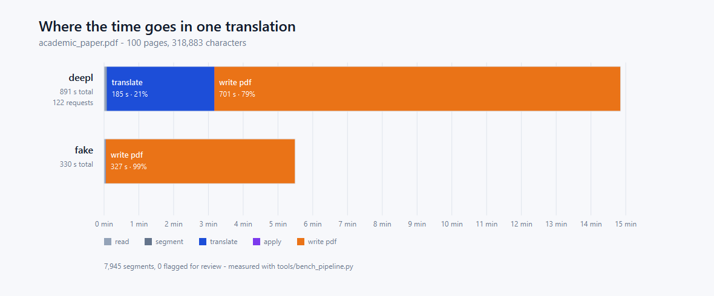

# Where the time goes

Measured, not estimated. Every number here comes from
[`tools/bench_pipeline.py`](../tools/bench_pipeline.py), which runs one document through the real
pipeline and records what each stage cost. The raw measurements are checked in beside the sample
documents (`docs/samples/bench_*.json`) so a later run can be compared against an earlier one
rather than against a memory of it.

```bash
.venv/Scripts/python.exe tools/bench_pipeline.py docs/samples/academic_paper_10.pdf deepl --out out.pdf --json run.json
```

The test document is a generated academic paper — two columns, numbered sections, labelled line
charts, tables with header rows, raster micrographs, a running head and page numbers. It is built
by [`tools/make_academic_paper.py`](../tools/make_academic_paper.py), so the measurement can be
reproduced from an empty checkout.


## What each run cost

| | 10 pages, DeepL | 100 pages, DeepL | 100 pages, no provider |
|---|---:|---:|---:|
| Blocks | 741 | 8,062 | 6,897 |
| Segments | 731 | 7,945 | 6,784 |
| Characters | 30,603 | 318,883 | 322,933 |
| Images | 4 | 54 | 54 |
| **read** | 0.3 s | 4.5 s | 2.8 s |
| **segment** | 0.0 s | 0.2 s | 0.1 s |
| **translate** | 12.7 s | 185.4 s | 0.1 s |
| **fit** | 39.4 s | not run | not run |
| **apply** | 0.0 s | 0.2 s | 0.1 s |
| **write pdf** | 12.7 s | 700.9 s | 326.5 s |
| **total** | **65.2 s** | **891.2 s** | **329.7 s** |
| Provider requests | 91 | 122 | — |
| Quota consumed | 30,410 chars | 301,726 chars | — |
| Segments flagged for review | 37 | not measured | not measured |

The third column runs the same document through a provider that hands the source straight back.
It is not a translation — it is there to separate what the network costs from what this project
costs.

**Only the first column is the whole pipeline.** The two 100-page runs were taken with a
benchmark that skipped the fitting stage entirely — no text was shrunk to its box, no over-long
translation was asked for again shorter, and nothing could be flagged, which is why those columns
report no flagged segments on a document that plainly has some. That was a defect in the
measuring tool, not a property of the product. It is fixed, and the 10-page run is the corrected
one; the 100-page columns are kept because they are the only measurement at that size, marked for
what they are.

Read against the corrected column, the shape of the job is: **fitting the text to its boxes costs
more than translating it, and more than writing the PDF.** It is where a translation into a
longer language actually gets paid for.

## Per unit of work

| | 10 pages | 100 pages |
|---|---:|---:|
| Blocks per page | 74 | 81 |
| Write, per page | 1.27 s | 7.01 s |
| Translate, per 1,000 characters | 0.41 s | 0.58 s |

Translation scales about as expected: the per-character cost rises slightly with larger batches
because more of them hit the provider's slower path.

**Writing does not.** Ten times the document costs fifty-five times the write, and the cost per
page rises more than fivefold. The cause is known rather than suspected: `insert_htmlbox` loads its own
copy of a font for every call, even when handed the same archive, so a document with 8,062 blocks
embeds thousands of duplicate font subsets. `garbage=4` collapses them at save time, which is why
the output file stays small — but the work of building them is already done by then. This is a
real limit, it is not fixed, and a large document should be expected to take minutes.



## Reading these numbers honestly

- The 100-page runs were measured **before** the writer changes that followed them and without
  the fitting stage (see above). Their block counts are comparable to the 10-page run; their
  timings are not. They are kept because they are the only measurements at that size.
- The 10-page numbers moved a long way once one defect was fixed: a block was laid out against
  the tight glyph box the reader measured, while `insert_htmlbox` needs more room than that for
  its own inset. On a paragraph that is nothing; on a 6pt chart tick it is most of the width, and
  untranslated numbers were being shrunk to 4.4pt. Measuring and drawing now share one definition
  of the box. Segments needing any shrink at all went from 549 to 86, flagged from 334 to 37, and
  the whole run from 104 s to 65 s.
- The block count differs between the DeepL and no-provider 100-page runs (8,062 vs 6,897)
  because the no-provider run predates the table-reading fix, which splits a table's rows into
  cells instead of leaving them as one block. More blocks is the fix working, and it is also part
  of why that run's write time is not comparable.
- 37 of 731 segments are flagged: Turkish runs longer than English, and a box set for one does
  not always hold the other. That is the flag doing its job, not a failure - each one is a place
  the correction editor should be opened.
- Timings are from one machine, one run each. They are the right order of magnitude and the right
  *ratios*; they are not a benchmark suite.
