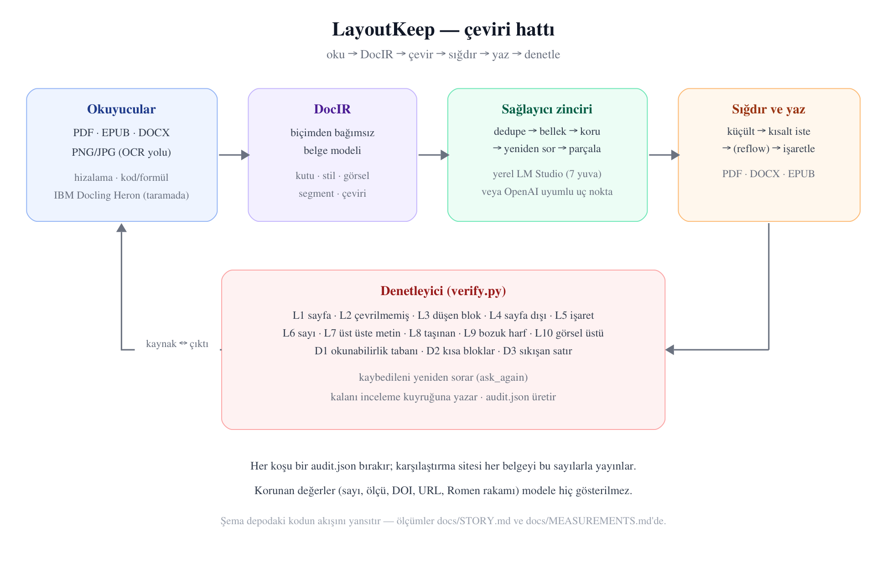
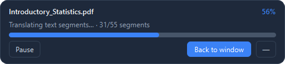
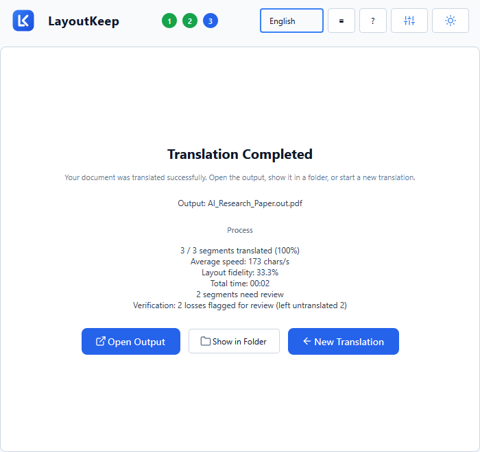
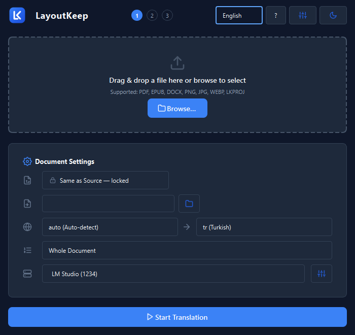
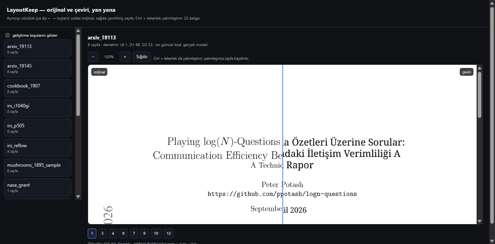

# Sıfırdan bugüne LayoutKeep

**Ölçülmüş bir mühendislik hikâyesi: ne denedik, ne kırıldı, neyi düzelttik, neyi geri aldık.**

> **English abstract.** LayoutKeep translates PDF, EPUB and DOCX documents without moving anything
> on the page: every text box keeps its position and its size, figures stay where they were, tables
> keep their rows. This document is the project's full record - how it started, what was tried and
> abandoned (including a full rewrite and a fine-tuning campaign), which bugs were found and how
> each root cause was measured, why the runtime model is a local one and why the layout detector is
> IBM Docling's Heron, and what is still known to be broken. Every number here comes from a command
> that is written down next to it.

---

## 0. Özet, sayılarla

| Ne | Değer | Nasıl ölçüldü |
|---|---|---|
| Desteklenen biçimler | PDF → PDF, EPUB, DOCX, PNG/JPG, LKPROJ | `capabilities.py` matrisi, iki yönlü testli |
| Kayıpsızlık kriteri | **10 kayıp (L1–L10) + 3 sığdırma (D1–D3)** | `verify.py`; kriterler denetleyicinin kendisinden okunur |
| Yayınlanan ölçüm seti | **22 belge**, 276 görsel, 0 "eski kayıt" | karşılaştırma sitesi (her belge kendi denetim sayılarıyla) |
| En büyük gerçek koşu | 220 sayfalık istatistik kitabı, 55 parça, 106 dakika | `translate_book.py`, `--workers 7` |
| Test paketi | **1187 test** | `.venv/Scripts/python.exe -m pytest -q` |
| Uygulama | tek dosya Windows exe (kurulumsuz), ~173 MB | PyInstaller onefile |
| Çalışma zamanı modeli | `google/gemma-4-e4b`, LM Studio, 7 yuva | yerel; belge makineden çıkmaz |

---

## 1. "Kayıpsız çeviri" tam olarak ne demek

Bir belgeyi çevirmek kolaydır; **yerini koruyarak** çevirmek zordur. Kaynak sayfada bir cümle
kutunun içinde durur, çeviri genelde %10–30 daha uzundur, ve o kutu büyümez: komşu paragraf,
şekil, tablo ve sayfa sonu oradadır. Naif bir çevirici ya kutuyu büyütür (sayfa akar, sayfa sayısı
değişir, şekiller kayar) ya da metni kırpar (bilgi sessizce kaybolur).

Bu projenin sözü şudur:

1. Her metin kutusu **kendi konumunu ve boyutunu** korur.
2. Görseller, tablolar, başlıklar, dipnotlar **yerinde kalır**.
3. Sığmayan ya da kaybolan her şey **işaretlenir** — sessizce kabul edilmez.

Üçüncü madde en önemlisidir: mükemmel olmayan bir sistem, neyi yapamadığını söyleyen bir sistemdir.
Bunun için her koşudan sonra yazılan çıktı **kaynakla karşılaştırılır** ve 13 kriterle denetlenir.

---

## 2. Başlangıç: ilk günler

Proje **10 Eylül 2026**'da tek bir cümleyle başladı: *"translate a document without moving anything
on the page"*. İlk günlerde alınan ve bugüne kadar taşınan kararlar:

- **Aracı bir belge modeli (DocIR).** Okuyucular (PDF, EPUB, DOCX, görüntü) belgeyi kendi
  yapısından bağımsız bir modele çevirir; yazıcılar o modelden hedef biçimi üretir. Böylece
  "PDF → DOCX" gibi çapraz dönüşümler ayrı bir kod yolu gerektirmez.
- **Kutunun sahibi kaynaktır.** Çeviri, kaynağın ölçtüğü kutunun içine yazılır; modelin ürettiği
  uzunluk asla düzeni belirlemez.
- **Ölçüm, iddiadan önce gelir.** Depodaki `docs/CONTRACT.md` bunu bağlayıcı kural yapar:
  *"bu belge ile bir ölçüm çelişirse, belgeyi düzelt ve ölçümün ne olduğunu yaz."*

İlk günlerin en pahalı dersi, iddia ile ölçüm arasındaki farktı: ilk "kayıpsız" raporlar yalnız
metin akışına bakıyordu. Görsel, grafik ve vektör tablo taşıyan gerçek belgelerle denendiğinde
iki gerçek hata ortaya çıktı — o günden sonra **zengin fixture** kuralı geldi: yalnız metin
taşıyan test dosyaları sessiz kayıpları gizler.

---

## 3. Mimari, kısaca

```text
oku → DocIR → çevir (sağlayıcı zinciri) → sığdır (fit) → yaz → denetle (verify)
```

- **Okuyucular**: `readers/pdf_reader.py`, `epub_reader.py`, `docx_reader.py`, `_layout.py`
  (hizalama çıkarımı), `_nonprose.py` (kod/formül tanıma), OCR yolu (taranmış sayfalar için).
- **Sağlayıcı zinciri** (`providers/`): `dedupe` (aynı metni bir kez çevir) → `cached`/`memory`
  (koşular arası bellek, SQLite) → `protected` (sayı, ölçü, DOI, URL, Romen rakamı modele hiç
  gösterilmez) → `retry` (aynısını geri veren modeli parça parça sıkar) → `split` (taşan bloğu
  cümle cümle sorar).
- **Sığdırma** (`fitting/`): kutuya sığmayan çeviri için sırayla küçültme, kısaltma isteme ve
  (isteğe bağlı) blokları aşağı itme (reflow) denenir; hiçbiri tutmazsa blok **işaretlenir**.
- **Yazıcılar** (`writers/`): PDF (PyMuPDF `insert_htmlbox`), DOCX, EPUB, TXT; kutu daraltma ve
  "kendi kutusunu dene" gibi kararlar burada.
- **Denetleyici** (`verify.py`): L1–L10 ve D1–D3; ayrıca `ask_again` ile kaybedileni yeniden sorar.



*Şema depodaki kodun akışını yansıtır: okuyucular → DocIR → sağlayıcı zinciri → sığdırma/yazma →
denetleyici, ve denetleyicinin geri beslemesi (kaynak ↔ çıktı).*

---

## 4. Kronoloji

| Dönem | Ne oldu |
|---|---|
| **10 Eyl** | PDF → PDF hattı, DocIR, karşılaştırma sayfası, ilk paketleme |
| **11–13 Eyl** | EPUB/DOCX yolları, zengin fixture'lar, görsel-üstü-metin ve tablo testleri |
| **14 Eyl** | Sığdırma (fit) geçişi, kısaltma merdiveni, `reflow` fikrinin ilk ölçümleri |
| **15–16 Eyl** | Masaüstü uygulaması (PySide6): kurulum, ilerleme, tamamlanma ekranları; sağlayıcı ayarları |
| **17 Eyl** | Kampanya düzeltmeleri: NIST, The Time Machine, Electricity in Agriculture koşularından çıkan hatalar |
| **18 Eyl** | Kayıpsızlık kampanyası: L kriterlerinin genişletilmesi, `lossless_audit`, held-out seti |
| **19 Eyl** | 7 paralel işçi, parça parça kitap çevirisi, `--resume`, bellek ve sözlük sağlayıcıları |
| **19–20 Eyl (gece)** | 220 sayfalık kitap (55 parça, 106 dk); L10'un ölçüm hatası; reflow'un iki ölçümü; uygulama içi sözlük; yardım ve karşılama ekranları; yüzen çubuk; sürümler 0.9.1 → 0.9.4 |

---

## 5. Hata kataloğu: belirti → kök neden → ölçüm → çözüm

Projenin en öğretici kısmı budur. Her satır gerçek bir koşudan geldi.

### 5.1 "Model bulunamadı" — ama model yerindeydi

**Belirti:** Uygulama, LM Studio'da model yüklüyken "model bulunamadı" diyordu.
**Kök neden:** Gerçek hata mesajı `Context size has been exceeded` idi: 8192 token'lık bağlam,
7 istek ve uzun paragraflarla doluyordu; sağlayıcı bunu "model yok" diye raporluyordu.
**Çözüm:** Bağlam 32768'e çıkarıldı, istek başına bütçe hesaplandı ve **taşma artık ölümcül
değil**: taşan blok parçalanıp yeniden sorulur (`providers/split.py`).

### 5.2 Yüzen ilerleme çubuğu uygulamayı çökertiyordu (0xc0000374)

**Belirti:** Koşu sırasında pencere kapanınca heap bozulması.
**Kök neden:** Sürükleme yardımcısı (`WindowDrag`) hedef widget'a **zayıf** referans tutuyordu;
widget yok olunca sarkan işaretçiye yazıyordu.
**Çözüm:** Güçlü referans + açık `deleteLater()`. Ölçüm: 20 dakikalık koşuda çökme yok.

### 5.3 Aynı metin onlarca kez çevriliyordu

**Belirti:** 55 parçalık kitapta başlık, dipnot ve künye satırları tekrar tekrar çevrildi.
**Kök neden:** Parçalar birbirinden habersizdi; aynı kaynak metin her parçada yeniden gitti.
**Çözüm:** `providers/dedupe.py` (aynı metni bir kez çevir) + `providers/memory.py` (koşular arası
SQLite belleği). İkinci koşuda aynı belge neredeyse bedava.

### 5.4 Kırılan satırlar: kazancı ölçüldü, **bedeli ölçülünce geri alındı**

**Belirti:** Dizin sayfalarında 6.7pt'lik satırlar 4.5pt'ye eziliyordu (okunamaz).
**Kök neden:** Blok kutuları birkaç punto üst üste bindiği için `room_below` negatif çıkıyor,
yazar kutuyu kısaltıyordu.
**Denenen çözüm:** Yazar, taban ölçek tutmazsa bloğun **kendi kutusunu** da denesin.
**Ölçüm:** cookbook'ta okunamaz 12 → 2 ✓ *ama* IRS formunun tam koşulunda **L7 (üst üste metin)
0 → 11** ✗. Aynı kayıtlı çeviriler üzerinde iki sürüm yan yana koşturuldu: korumasız L7=10,
korumalı L7=0 — korumalı sürüm ise cookbook kazancını da sıfırlıyordu (12 → 12).
**Sonuç:** Değişiklik **tamamen geri alındı**. Kural: *bir düzeltmenin kazancını ölçmek yetmez,
bedelini de ölç.*

### 5.5 L10'un yarısı kendi ölçüm hatamızdı

**Belirti:** "Görselin üstünde metin" kriteri cookbook'ta 182, mushrooms'ta 124 kelime bildiriyordu.
**Kök neden (ölçüm hatası):** O sayfalarda görsel **döşemeli** — tarama iki katman + satır yamaları;
her kelime zaten taramanın üstünde. İkinci sınıf: arXiv grafiğinin **kendi etiketleri** kaynakta
metin olarak duruyor (kaynakta 28, çeviride 26).
**Çözüm:** Görseller tek tek değil **birleşim alanıyla** değerlendirilir; kaynağın o görsel
üzerinde zaten yazdığı kelimeler çıkarılır. Gerçek kalan iki Wikipedia sayfası ise **13 → 0**
düzeldi (yeniden çevirimle).

### 5.6 Karşılama ekranı test paketini asıyordu

**Belirti:** Test paketi %89'da 15 dakika bekledi.
**Kök neden:** İlk-çalıştırma ekranı *modal* açılıyor; otomatik oturumda kimse kapatamıyor.
**Çözüm:** `LAYOUTKEEP_NO_WELCOME` anahtarı; test oturumu kendi kurar.

### 5.7 Sözlük ve bellek yalnız komut satırındaydı

**Belirti:** Ayarlarda "çeviri belleği" vardı ama uygulama hiç kullanmıyordu (`memory_path` boş).
**Kök neden:** Özellik CLI'da bağlıydı, arayüzde değil.
**Çözüm:** İkisi de arayüze bağlandı; sözlük **uygulama içi tablo düzenleyici** + JSON/CSV/TSV
okuma kazandı.

### 5.8 Yüzen çubuk: iki pencere aynı anda, ve kaybolunca geri gelmiyor

**Belirti (kullanıcı ekran görüntüsü):** Koşu başlayınca hem pencerenin kendi ilerleme ekranı hem
çubuk görünüyordu; pencere küçültülünce **çubuk da kayboluyordu**; çubuk bir kez kapatılınca geri
açılamıyordu.
**Kök neden (iki tane):** (1) Çubuk ana pencereye **çocuk** olarak yaratılmıştı — Windows sahipli
pencereyi sahibiyle birlikte küçültür. (2) İş başlarken koşulsuz gösteriliyordu ve geri getirecek
bir denetim yoktu.
**Çözüm:** Çubuk ebeveynsiz üst-düzey pencere (ömrü açık `deleteLater()` ile yönetilir); pencere
ve çubuk **sırayla** görünür; başlığa **▤ "Küçük pencereye geç"** düğmesi eklendi (çubuktaki
"Pencereye dön" ile çift yönlü). 7 test bu davranışı tutuyor.

### 5.9 Uygulama tek istek gönderiyordu (7 yuva ayarlıyken)

**Belirti (kullanıcı bildirimi):** *"paralel 7 slot ayarlı olsa da aynı anda sadece 1 slot
yolluyor"*.
**Kök neden:** Paralellik **komut satırında** vardı (`ThreadPoolExecutor`, parça başına bir alt
süreç); uygulamanın çeviri döngüsü ise segment batch'lerini **tek tek** gönderiyordu. LM Studio'nun
yuva ayarı tam da bunun için yapılmıştı — yani uygulama, aynı motorun yavaş kullanımıydı.
**Çözüm:** Döngü dalga dalga çalışır: her dalgada `translation.workers` batch paralel gider, dalga
sonunda duraklat/iptal kontrol edilir, sonuçlar **belge sırasına göre** birleştirilir. Her paralel
iş parçası kendi sağlayıcı zincirini alır (dedupe önbelleği ve bellek bağlantısı paylaşılırsa yarış
olurdu). Üç yeni test: eşzamanlılık gerçekten >1, tek işçide sıralı, çıktı belge sırasında.

### 5.11 Ayar ekranındaki ölü anahtar

**Belirti (kullanıcı isteği):** *"uygulamanın arayüzüne bağlanmamış ayarları bul ve uygulamaya bağla."*
**Ölçüm:** Bildirilen 30 ayarın anahtarları, `src/` içinde okunan anahtarlarla karşılaştırıldı.
Bir tanesi — `timeout.first_batch_s` — ayar ekranında **görünüyor, kaydediliyor ve hiçbir şey
okumuyordu**: ilk partinin zaman aşımı sabitten geliyordu. Ayrıca ayar ekranının 30/30 gösterdiği
de ölçüldü.
**Çözüm:** Anahtar worker'a bağlandı (warm partiler kendi sabitini korur). Beş test: "bildirilen her
ayar kodda geçmeli" (ölü anahtar bir daha sızmasın), ilk-parti ayarının zaman aşımına ulaştığı,
warm partinin ondan etkilenmediği, varsayılan paralelliğin 2 olduğu, ayar ekranının her bildirileni
gösterdiği. **Ders:** çalışmayan bir anahtar, hiç olmayan bir anahtardan kötüdür — çalışanlara olan
güveni harcar.

### 5.10 Tarama gürültüsü sessiz değil

**Belirti:** NASA taramasında dekoratif başlık "Naga Merorautigs Frogrom Amerika" diye okundu.
**Çözüm:** Blok "OCR güveni düşük (0.62)" ile **işaretlenir** — sessiz kayıp değil, kullanıcıya
söylenen bir vaka.

---

## 6. Model seçimi: hangi model, neden

### 6.1 Çalışma zamanı LLM'i: yerel, tek, sabit

| Denenen | Sonuç |
|---|---|
| Bulut API'leri (Gemini ve benzerleri) | Kalite iyi, ama belge makineden çıkıyor ve maliyet sayfa başına |
| Ücretsiz yönlendiriciler (OpenRouter/free) | **Reddedildi:** küçük bağlamlı modele düşüp tekrar döngüsüne giriyor ("repetition loop"), uzun belgelerde kullanılamaz |
| Yedek zinciri (büyük bulut modeller) | Yalnız yedek olarak duruyor |
| **Yerel LM Studio + `google/gemma-4-e4b`** | **Seçildi:** belge makineden çıkmaz, yuva başına bağlam denetlenebilir, 7 paralel işçi CPU/GPU'yu doyurur |

Gerekçe ölçülebilir: bu proje **yerel bir modelle** uçtan uca çalışır ve kalite farkı modelin
becerisidir, düzenin garantisi değil — düzen garantileri modelden bağımsızdır.

### 6.2 Düzen modeli: neden IBM Docling (Heron)

Metin çıkarma, kural yazmakla değil **görsel nesne algılama** ile daha doğru yapılır. Başlangıçta
`docs/YENI_MIMARI_VE_GECIS_PLANI.md` bunu şöyle koyuyordu: *"IBM Docling, MinerU, Marker, RT-DocLayout
metin çıkarmayı kural yazarak değil, görsel nesne algılama ve ilişki grafı ile çözer."*

- **Seçilen**: IBM Docling'in **Heron** düzen modeli (RT-DETRv2, ONNX) — DocLayNet üzerinde
  eğitilmiş; başlık, paragraf, tablo, formül, dipnot ve şekil altı yazılarını ayırır; CPU'da
  ~80–140 ms/sayfa. Lisans Apache-2.0, ilk kullanımda indirilir, **paketlenmez**.
- **Neden V2 değil:** O plan tam bir yeniden yazım öneriyordu (`LayoutKeep_V2`). V2 denendi ve
  **terk edildi**; ama planın işe yarayan parçası — düzen algılayıcı — mevcut motora alındı
  (`--layout-detector`, `ocr/layout_detector.py`). Yani karar "her şeyi değiştir" değil,
  "kanıtlananı al" oldu.
- **Ne zaman çalışır:** Yalnız taranmış/karmaşık sayfalarda; dijital belgelerde PyMuPDF'in kendi
  metin katmanı yeterli ve daha hızlıdır.

### 6.3 İnce ayar (fine-tune) denemesi

Ayrı bir hat olarak `LayoutKeep_Qwen_QLoRA` denendi: Qwen2.5-7B-Instruct, Kaggle'da QLoRA,
6.000 örnek. Amaç ikiydi: (1) uygulamanın **tel protokolüne** uyum (çok segmentli JSON, `<0>..</0>`
işaretleri, korunan değer token'ları), (2) akademik düzeyde EN↔TR çeviri. Veri omurgası OPUS-100
gibi hazır külliyatlar yerine **elle yazılmış alan çiftleri** oldu (OPUS en-tr ölçülüp reddedildi:
haber/günlük konuşma ağırlıklı). Bu hat bugün deneysel durumda; çalışma zamanı modeli yerel
gemma'dır.

---

## 7. Ölçüm disiplini: yanlış ölçümleri kim ölçtü

Projenin en değerli çıktılarından biri araçlarının kendisidir:

| Araç | Ne yapar |
|---|---|
| `tools/audit/lossless_audit.py` | Bir koşuyu 13 kriterle denetler, `audit.json` yazar |
| `tools/audit/rewrite_run.py` | Kayıtlı bir koşuyu **güncel yazıcıyla** yeniden çizer — model gerekmez, A/B için |
| `tools/audit/type_drift.py` | Yazılan sayfanın tip sapması: büyümüş/küçülmüş/hizası değişmiş/okunamaz bloklar (artık **kaynak sayfayla** karşılaştırır) |
| `tools/audit/text_over_image.py` | Görsel-üstü metin; birleşim ve kaynak kurallarıyla |
| `tools/audit/comparison_site.py` | Yayınlanan karşılaştırma sitesi (kaynak ↔ çeviri, denetim sayılarıyla) |
| `tools/audit/live_check.py` | Kayıtlı ölçümlerin üstüne yazmadan yeni koşu |

Bu araçlar sayesinde üç büyük **ölçüm hatası** yakalandı ve düzeltildi: (1) "bariz daha büyük font"
iddiası — ölçüm bloğun stilini yanlış eşleştiriyordu, düzeltilince **0 büyümüş** çıktı; (2) L10'un
iki yanlış-pozitif sınıfı (§5.5); (3) `type_drift`'in hiza bayrakları — kaynağın dikey sayı
şeritlerini "hizasız" sayıyordu, kaynakla karşılaştırınca IRS'te 14 → 2 düştü.

---

## 8. Ürünleşme: uygulama

- **Karşılama ekranı** (5 sayfa, TR/EN/DE): ne yapar, ilk çeviri üç adım, çeviriyi kim yapar,
  kaliteyi ne belirler, hazırsın. Dil ve tema orada seçilir; atlanabilir; güncellemede bir kez
  daha görünür (sürüm kaydedilir).
- **Yardım ekranı** (`?`): yedi bölüm; **kayıpsızlık kriterleri doğrudan denetleyiciden okunur**,
  yani bayatlayamaz.
- **Sözlük**: uygulama içi tablo düzenleyici, JSON **veya** iki sütunlu CSV/TSV; kullanılmayan
  terim inceleme kuyruğuna düşer.
- **Çeviri belleği**: koşular arası SQLite; aynı paragraf ikinci kez çevrilmez.
- **Yüzen çubuk**: pencereyi arkaya atınca koşu küçük çubukta sürer; ▤ ile geçilir, "Pencereye
  dön" ile dönülür.
- **İnceleme kuyruğu**: her koşu, neyin denetlendiğini ve neyin insan beklediğini söyler.

| Karşılama ekranı (ilk açılış) | Yardım ekranı (kriterler denetleyiciden) | Sözlük düzenleyici |
|---|---|---|
|  |  |  |

| Yüzen çubuk (pencere arkada) | Tamamlanma ekranı | Koyu tema |
|---|---|---|
|  |  |  |

---

## 9. Sonuçlar ve dürüst sınırlar

Bugünkü durum (ölçülmüş):

| Belge | Parça | Kalan gerçek kayıplar |
|---|---|---|
| Wikipedia ×2 (yeniden çevirim) | 19 / 33 | L2 satırları; **L10 = 0** |
| cookbook_1907 | 35 | L6=2, D1 (küçük punto) |
| mushrooms_1895_sample | 41 | L2=1, L6=1 |
| NIST dergisi / NISTIR taraması | 8 / 6 | L1 kısmi koşu; **L2–L10 = 0** |
| IRS formu (48 parça) | 48 | L7=11 (yoğun form; yukarıdaki yazıcı sürümüyle koştu) |
| 220 sayfalık kitap | 55 | L2=2, L6=4, L10=0, D1=801 (küçük punto sınıfı) |



*Yayınlanan karşılaştırma sitesi: solda orijinal, sağda çeviri, üstte o belgenin denetim sayıları
(`arxiv_19113` örneğinde: 8 sayfa · denetim L6 1, D1 68, D2 23).*

**Bilinen sınırlar:** tablo başlıklarındaki **sayı şeritleri** (bir satır boyunca ayrı x
konumlarına dağılmış salt sayı dizileri) çeviride tek bir sola yaslı bloğa düşebilir — sayılar
korunur, dizilişleri kaybolur; kaynakça satırları ve numaralı başlıklar bazen kaynak dilde kalır (L2, işaretli);
yoğun formlarda okunabilirlik tabanının altına inen bloklar vardır (D1; `reflow` modu bu sınıfı
kaldırır ama sabit düzenlerde metni üst üste bindirebilir, o yüzden varsayılan kapalıdır); taranmış
sayfalar OCR kalitesine bağlıdır ve düşük güvenle işaretlenir; **sağdan sola yazı sistemleri
uygulanmamıştır**; kalite modelin becerisidir.

---

## 10. Dış kaynaklar ve atıflar

| Kaynak | Rolü | Lisans |
|---|---|---|
| [PyMuPDF](https://pymupdf.readthedocs.io/) | PDF okuma/yazma motoru | AGPL-3.0 |
| [Qt / PySide6](https://doc.qt.io/qtforpython/) | Masaüstü arayüzü | LGPL-3.0 |
| [IBM Docling — Heron düzen modeli](https://huggingface.co/docling-project/docling-layout-heron-onnx) | Taranmış sayfalarda düzen algılama (RT-DETRv2, ONNX) — raporu [arXiv:2509.11720](https://arxiv.org/abs/2509.11720) | Apache-2.0 |
| [BabelDOC](https://github.com/funstory-ai/BabelDOC) | Karşılaştırma: paralel PDF çevirisi; "kayıpsız" iddiasının ölçülmesi fikri | AGPL-3.0 |
| [PDFMathTranslate](https://github.com/Byaidu/PDFMathTranslate) | Karşılaştırma: formül koruma ve kısa çeviri isteme | AGPL-3.0 |
| [MinerU](https://github.com/opendatalab/MinerU) | Karşılaştırma: okuma sırası ve kademeli sığdırma (reflow) fikri | AGPL-3.0 |
| [google/gemma](https://ai.google.dev/gemma) | Çalışma zamanı modeli (yerel, LM Studio) | Gemma Terms |
| [IBM Plex](https://github.com/IBM/plex) | Yayınlanan karşılaştırma sayfasının yazı tipi | SIL OFL 1.1 |
| NIST, NASA, PLOS, Wikipedia, Project Gutenberg | Ölçüm belgeleri (yalnız kamu malı/açık lisanslılar yayınlanır) | çeşitli |

---

## 11. Dersler

1. **Kazancı ölçmek yetmez, bedelini de ölç.** (§5.4)
2. **Bir kriterin ne saydığını, kullanmadan önce ölç.** (§5.5)
3. **Bir regresyonu tek koşuya bakarak suçlama** — aynı girdiyle iki sürümü yan yana koştur.
4. **Arayüz ile komut satırı ayrı düşebilir.** Bugüne kadar üç kez oldu: sözlük/bellek, sığdırma
   modu, paralellik. Her biri "özellik var ama kullanılmıyor" diye ortaya çıktı.
5. **Sessiz kayıp, gürültülü hatadan kötüdür.** Her koşu, neyi yapamadığını yazar.
6. **Ölçüm hatası, kod hatasından sinsi.** Araçlarını da denetle.
7. **Yeniden yazım yerine kanıtlananı al.** V2 terk edildi, düzen algılayıcı kaldı.

---

*Bu belge, depodaki `docs/campaign/JOURNAL.md`, `docs/KAYIPSIZ_MOD_DURUM.md`,
`docs/LOSSLESS-REPORT.md`, `docs/MEASUREMENTS.md`, `docs/ENGINE-ARCHITECTURE.md` ve
`docs/CONTRACT.md` dosyalarından ve 164 commit'lik geçmişten derlendi.*
